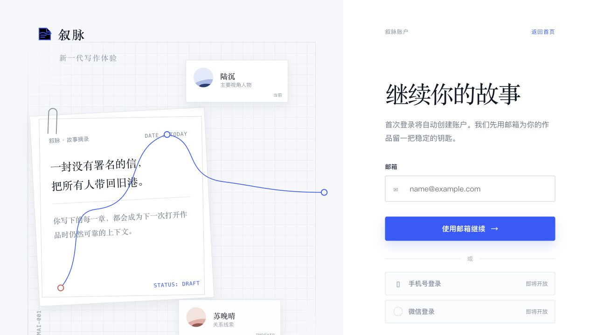
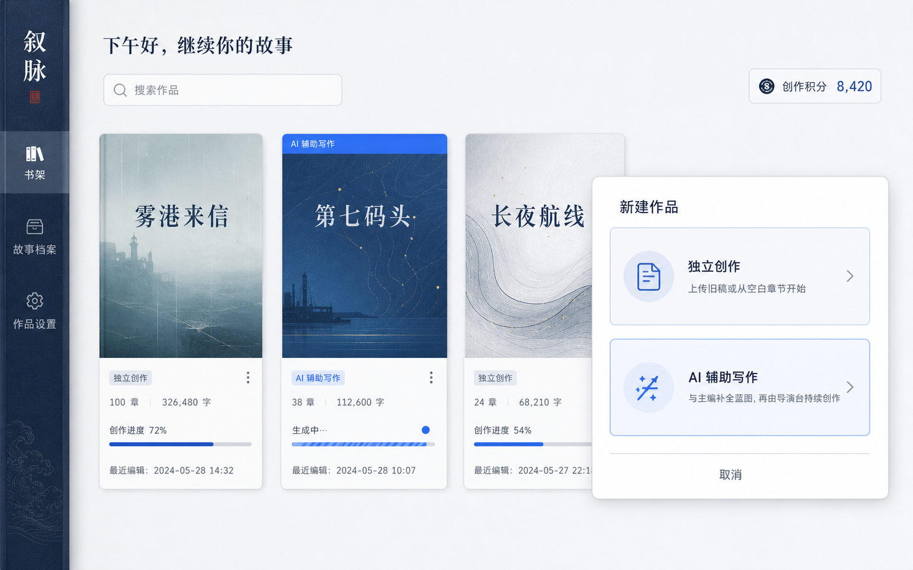
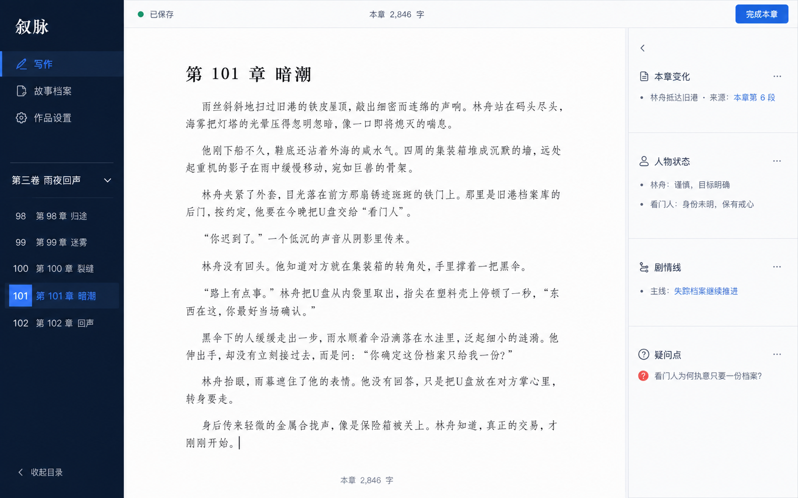
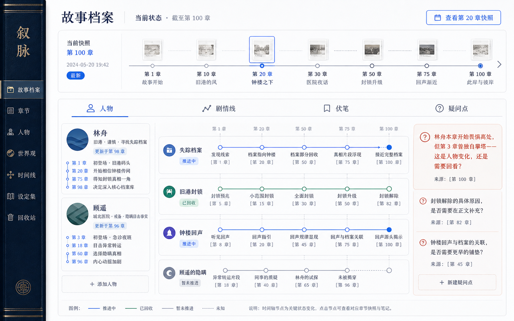
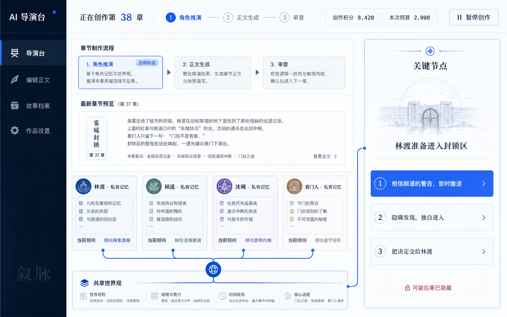

<div align="center">

# 叙脉

### 新一代写作体验

面向中文长篇作者的 Web 写作与作品记忆工具。

[快速开始](#快速开始) · [产品预览](#产品预览) · [使用方式](#使用方式) · [Windows 迁移](docs/WINDOWS_MIGRATION.md) · [文档](#文档)

</div>

<p align="center">
  
</p>

叙脉让长篇故事在写作、人物、剧情线、伏笔、疑问点和章节快照之间保持连贯。你可以自己写，也可以让 AI 辅助推进；正文始终只有一条，作者始终拥有最终决定权。

## 为什么是叙脉

| 独立创作 | AI 辅助写作 |
| --- | --- |
| 你写正文，叙脉保存并理解作品变化 | 先与主编补全蓝图，再由导演台辅助推进 |
| 安静的三栏编辑器、自动保存、章末分析 | 全自动继续或关键节点暂停 |
| 角色、剧情线、伏笔和疑问点可回溯 | 每个节点恰好三个选择，始终维护唯一正文 |

## 产品预览

### 当前实现

下面是本地开发服务中实际打开的页面截图：

<p align="center">
  
  
</p>

### A 版效果参考

这些图片是仓库中的 A 版界面效果参考，用来表达产品的视觉方向与交互意图，不等同于线上截图：

<table>
  <tr>
    <td></td>
    <td></td>
  </tr>
  <tr>
    <td align="center">书架与新建作品</td>
    <td align="center">独立创作编辑器</td>
  </tr>
  <tr>
    <td></td>
    <td></td>
  </tr>
  <tr>
    <td align="center">故事档案与章节快照</td>
    <td align="center">AI 导演台与关键节点</td>
  </tr>
</table>

## 使用方式

```text
首页 → 邮箱登录 → 书架
  ├─ 独立创作 → 空白 / 导入 → 编辑器 → 完成本章 → 故事档案
  └─ AI 辅助写作 → 主编创作室 → 确认蓝图 → 导演台 → 编辑器 / 故事档案
```

### 独立创作

1. 新建“独立创作”，选择空白开始或上传 TXT、MD、DOCX。
2. 在导入预览中确认标题、章节识别和字数，再写入正式正文。
3. 在三栏编辑器中写作；正文自动保存，保存冲突会明确提示。
4. 点击“完成本章”，系统在后台更新章节快照和故事档案。
5. 需要回看时，打开档案切换到任意历史章节快照；历史内容只读。

### AI 辅助写作

1. 新建“AI 辅助写作”，进入主编创作室。
2. 通过对话补全故事蓝图，也可以直接编辑蓝图字段。
3. 点击“确认蓝图并开始创作”，进入导演台。
4. 选择“全自动继续”，或在关键节点暂停并从三个互斥选项中选一个。
5. 选择会成为唯一正式路线；生成完成后进入普通正文编辑器和故事档案。

无 Key 时使用确定性演示，不消耗创作积分；有 OpenAI-compatible 配置时才调用模型，供应商失败进入可重试状态，不静默替换成模板。

## 快速开始

需要 Python、[uv](https://docs.astral.sh/uv/) 和 Node.js。

```bash
git clone https://github.com/Reen-Ai-H/novelagent-xumai.git
cd novelagent-xumai

uv venv .venv
uv pip install --python .venv/bin/python -r requirements.txt
cp .env.example .env

.venv/bin/python -m uvicorn main:app --host 127.0.0.1 --port 8000
```

打开 <http://127.0.0.1:8000>。停止服务：在终端按 `Ctrl-C`。

端口被占用时，把 `--port 8000` 换成其他本地端口。首次体验不需要模型 Key。

## 模型配置（可选）

复制 `.env.example` 为 `.env`，只在本机填写真实值，绝不要提交 `.env`：

```dotenv
OPENAI_API_KEY=
OPENAI_BASE_URL=https://api.deepseek.com/v1
LLM_MODEL=deepseek-chat
LLM_TEMPERATURE=0.7
```

也兼容 `LLM_BASE_URL`，以及百炼别名 `DASHSCOPE_API_KEY`、`DASHSCOPE_BASE_URL`、`DASHSCOPE_MODEL`。

## 开发状态

- 阶段 27 独立审计：P0/P1/P2/P3 均为 0。
- 阶段 32 深度作品拆解已合并到 `main`：204 tests，0 failed，0 skipped；独立审计 P0/P1/P2/P3 均为 0。
- API 基线：OpenAPI 58 paths / 61 operations；旧 `/novel` 16 paths / 19 operations。
- 真实 DeepSeek 连续三章链路已验证。
- 独立作品拆解工作区已升级为总览与人物、剧情、伏笔、章节节奏、读者体验、文笔技法六个视角；重要结论可打开证据抽屉，当前稿本可精确定位，历史证据保持只读。
- 离线质量门研究 Q2 已验证：36 例脱敏黄金集，宏 F1=1.000、semantic-needed 覆盖率 1.000、14 项测试通过，外部请求/Token/费用为 0；真实生成质量增益及产品集成仍 pending，Q3 未执行。
- 文学质量阶段 23B 结论为 C；功能审计通过不等于小说质量通过。

这是 V1 本地开发版，不是生产部署。正式支付、管理员、云端同步、手机号/微信登录、分享发布、多人协作和平行正文不在当前范围内。

## 验证

```bash
.venv/bin/python -W ignore -m unittest discover -s tests -q
.venv/bin/python -m compileall -q app schemas main.py
node --check frontend/app.js
git diff --check
```

## 数据与安全

账户、正文、作品档案、模型安全元数据和事务恢复数据保存在本地 `.novel_*` 目录。备份前先停止服务；不要直接编辑 JSON，也不要把 `.env` 或 `.novel_*` 提交到 Git。

故事人物的私有记忆只用于服务端单人物推演，不返回浏览器；自动化测试使用 fake/确定性运行时，不调用真实模型、图片或付费服务。

## 文档

- [作者使用说明](docs/USER_GUIDE.md)
- [Windows 迁移与本地运行](docs/WINDOWS_MIGRATION.md)
- [架构说明](docs/ARCHITECTURE.md)
- [开发与运维](docs/DEVELOPMENT.md)
- [产品规格](docs/PRODUCT_SPEC.md)
- [交互流程](docs/UX_FLOWS.md)
- [设计系统](docs/DESIGN_SYSTEM.md)
- [验收标准](docs/ACCEPTANCE.md)
- [知识收口矩阵](docs/CLOSEOUT_MATRIX.md)

## License

当前仓库未声明开源许可证；如需公开再分发，请先确认项目授权范围。
