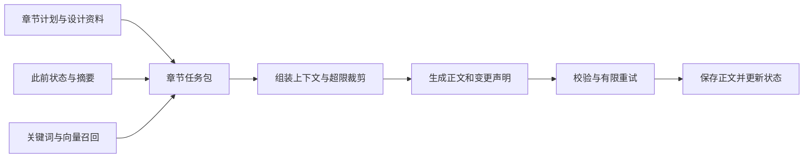

# 小说生成产品机制调研与叙脉改进建议

> 落地范围已按用户后续要求收敛：质量达标即可，保持系统轻量。本报告用于理解可借鉴的机制，不是必须实施的功能清单；地点、场景和上下文机制均按实际缺口最小补充。现役目标以 [阶段 32 任务书](../goals/STAGE_32_DECONSTRUCTION_DEPTH.md) 为准。

## 先看结论

**建议保留叙脉的轻量路线，补上“可追溯的作品资料库、按任务选择上下文、按阶段保存变化”。目前没有理由先整体迁移到某个知识库平台，也没有证据支持直接照搬天命就能解决长篇质量问题。**

本次最有价值的发现有五项。

1. **Novelcrafter 的 Codex 是作品资料库及其使用机制。** 它围绕人物、地点等词条，提供别名、阶段变化、关联引用和上下文选择。它的名称不代表某种专用小说模型。公开文档足以解释这些功能，但不足以判断其后台用了什么数据库。[^1][^2][^3]
2. **地点值得成为独立对象，场景也值得成为中间层。** 地点连接人物行踪和事件；场景把地点、时间、人物行动组织起来。前端仍应以大剧情节点为主，细场景放在节点里面。后半句是对叙脉的设计建议。
3. **作者看到的完整人物卡，不应该原样成为每次模型调用的输入。** Novelcrafter 明确区分用于生成的描述与研究笔记，并允许控制资料是否进入上下文。这能同时回应“人物卡需要丰富”和“输入太臃肿”的问题。[^1][^8]
4. **天命有实质性的上下文、混合召回、变更回写和重试代码；“长篇可靠性已经解决”仍不能成立。** 作者声明公开版存在待修问题；源码中部分语义检查采用关键词规则，存在误判风险。[^15][^19][^22][^26]
5. **叙脉下一步应验证一条完整链路：正文证据 → 人物与地点等对象 → 场景和事件 → 明暗线综合 → 前端核对。** 不再优先扩充框架，也不让每个分段反复输出截至当前的整份大报告。

## 一、研究范围与证据边界

研究时间为 2026 年 9 月 13 日。重点检查 Novelcrafter 官方帮助文档，以及天命公开仓库的根目录源码；以 Sudowrite、NovelAI 和天命配套 Skill 做交叉对照。

天命审查版本固定为 `f5c8307b8c740d6e8d31afa0070b369b23d05128`，该提交时间为 2026 年 8 月 20 日。仓库另有 `1.4.6-天命/` 副本，本报告没有把两份代码混在一起判断。配套 Skill 是另一个仓库，单独列为补充材料。

| 证据类型 | 本报告实际做了什么 | 可以据此判断什么 |
|---|---|---|
| 官方帮助文档 | 阅读词条、上下文、阶段更新、场景生成等页面 | 产品公开说明的功能和操作方式 |
| 公开代码 | 下载源代码并静态追踪生成入口、上下文、召回、校验和回写 | 具体路径存在的机制及可见风险 |
| 本地叙脉实现 | 核对现有拆解合同、人物聚合、全书分析循环和生成图 | 当前差距，而非仅对照旧规划 |
| 效果与成本 | 未运行这些产品的付费生成，未做长篇对照实验 | 不能认证文学质量、误判率或整书费用 |

商业网站的介绍、GitHub 星标、字段数量，都不作为小说质量或付费需求的证明。文中的“建议”和“推断”是综合判断，区别于已读到的产品功能和代码事实。

## 二、Novelcrafter：真正值得借鉴的 Codex

### 2.1 它解决的是资料组织和资料选择

其词条类型包括人物、地点、物品、背景设定、支线和其他。单个词条可以保存名称、别名、描述、标签等信息。名称和别名可用于检测提及；标签主要用于整理、筛选，官方说明标签本身不会自动发给模型。[^1][^2]

由此要区分三个概念：

| 概念 | 实际作用 | 对叙脉的启发 |
|---|---|---|
| 完整词条 | 作者整理和查看作品资料 | 人物卡可以有充分的动机、关系、变化和证据 |
| 生成时使用的描述 | 进入模型输入的资料 | 每次只取与任务有关的短版本 |
| 标签、筛选与提及记录 | 帮助作者组织和导航 | 界面上的信息不一定需要进入模型 |

例如，一张人物卡可以有完整的关系变化和十处依据，但本次分析只需要“当前身份、与在场人物的关系、尚未确定的身份问题”三个片段。**丰富展示和精简上下文能够使用同一份底层资料。**

### 2.2 别名能触发词条，但歧义仍需要理解

Novelcrafter 支持给人物配置昵称、称号等别名，并根据相关文本的提及检测词条。官方还提供大小写、排除项等匹配设置。[^3][^4]

这可以处理已经确认的对应关系，例如同一人物的本名和独特外号。它不能据此被认定为自动解决了以下情况：

- 不同人物都被叫作“师父”“宗主”。
- “他”在一个段落里多次转换指代对象。
- 一个称号被继承，前后指向不同的人。
- 假扮、夺舍或身份揭晓使“身体”和“行动者”不同。

**对叙脉的建议：名称匹配只负责提出候选，模型结合说话者、关系、场景和已读范围判断归属。** 没有把握时保留未归属提及，后文提供证据后再修正。不得为了资料库整洁而强行合并。

### 2.3 它允许明确控制哪些词条进入模型

公开文档列出四种上下文策略：始终加入、检测到时加入、检测到也不自动加入、永不加入。其中“不自动加入”仍允许通过手动场景上下文等方式选择。[^3]

这给叙脉一个直接可用的思路：每次模型调用都能说明资料为什么被选中。建议记录一个简短的内部清单：本次正文范围、人物和地点条目、相关线索、检索片段、选择原因及预计用量。默认折叠，供开发和核对使用。

Novelcrafter 也有实际提示词预览，用户能看到最终组合的内容。这个能力比只显示“已连接知识库”更有解释力。[^9]

### 2.4 阶段变化比覆盖一张人物卡更重要

其 Progressions 可以从指定场景起生效，对资料进行追加或替换。官方示例涉及人物身份、外貌、物品归属及地点变化；更早场景不会直接使用之后的更新。[^5]

**建议叙脉借鉴阶段生效机制，但增加文学分析所需的区分：**

- 故事世界中何时发生变化。
- 正文何时向读者揭示变化。
- 哪些人物在这个阶段知道。
- 这一条是事实、传闻，还是分析推断。

仅有“第几章更新”不足以处理倒叙和隐瞒。拆解中也不能把分析者读到结局后的知识，提前放进前半本的读者视角。

### 2.5 地点筛选有价值，矩阵也有价值

Novelcrafter 的 Matrix 以场景组织内容，可以结合人物、地点等 Codex 类型进行筛选；词条出现在摘要、正文或手工关联中，会影响其在矩阵中的显示。[^7]

这种呈现适合检查某个人物或地点贯穿了哪些场景。对叙脉而言，可借鉴为“选中地点，查看相关大剧情，再进入其中的场景”。

但**提及频次不能直接等同于人物出场或地点到访**。正文里“他想起长安”不意味着他正在长安。因此，叙脉需要分别记录“发生于”“实际在场”“提到过”“回忆中出现”，不要只统计字符串。

### 2.6 一个容易误解的功能：Relations

Novelcrafter 的 Relations 主要用于关联词条、把相关资料一起带入上下文。官方特别说明，它并非用来表达父子等语义关系；关系连接本身不会作为这种人物关系说明进入提示词。[^6]

例如，选择某个酒馆时顺带加入老板资料，是“上下文关联”。“老板是主角的父亲”则是“故事事实关系”。叙脉需要明确分开，否则一张看似丰富的关联图无法解释人物关系。

### 2.7 对“提高生成质量”应如何理解

其公开生成流程以场景指令为核心：作者写出当前场景要发生什么，选择提示词和模型，生成后决定应用、重试或舍弃。[^10]

官方也提醒，词条描述不宜不断膨胀；过多细节可能反复进入正文，补充资料可以放入不默认参与生成的位置。[^8]

因此，合理推断是：它通过提供合适的资料和作者控制，减少部分遗忘和偏题问题。**本次没有找到足以证明它能自动完成高质量中文长篇的对照证据。** 同样，公开帮助文档没有说明它使用 Neo4j、GraphRAG 或某种专属向量数据库，不能从 Codex 名称反推技术栈。

## 三、天命：有实现，但需要逐层判断可靠性

### 3.1 公开代码里的主流程

沿生成入口可以读到以下链路：先取得章节任务上下文和事实快照，补充远距离召回，再交给自动重写引擎；通过校验后，由严格保存路径处理正文和变更。[^32][^19][^28]

任务包不仅有人物，还包含地点、势力、世界规则、章节计划、蓝图、场景、前文摘要、上一章结尾、历史关键事件和召回片段。分层提示词则把事实、召回资料、章节任务和输出约束组合起来。[^16][^17]

**值得借鉴的是“围绕当前任务装配资料”的边界。** 不能把一个长篇项目所有设定都理解为每次都必需，也不能因为类里有很多字段，就认为这些字段被选得准确。

### 3.2 上下文控制确实存在，但不是完全摆脱窗口

代码在调用前估算系统提示词和任务提示词的总用量，超过窗口时尝试降级；仍放不下则终止。这说明它确实做了总量控制。[^19]

裁剪大致从远距离召回和首次描述片段开始，再减少历史卷、旧摘要；最后还会裁掉部分任务资料。极端分支会把人物、地点列表限制为前 15 项，世界规则限制为前 3 项。[^20]

这条路径有三个值得修正的地方：

| 源码观察 | 影响判断 | 叙脉应如何处理 |
|---|---|---|
| 估算按汉字和其他字符的固定比例计算 | 是近似计数，不能视为模型真实 tokenizer 结果 | 支持供应商口径和安全余量，记录实际 usage 校正估算 |
| 此处把输入与整个 context window 比较 | 此处没有扣除输出预留；不代表最终请求所有环节都没有其他保护 | 输入、输出和余量统一预留，并限制重试会话增长 |
| 极端降级直接取列表前若干项 | 可能丢掉本章关键资料；顺序不等于重要性 | 给硬约束设不可裁剪标记；仍超限则拆任务或明确停止 |

前两项分别可在 TokenEstimator 和生成引擎中定位；第三项可在 DegradeContext 中定位。以上为静态审查，未复现实际长篇失败。[^19][^20][^21]

配置中还有前文摘要、活跃实体、状态注入数量及召回配额等限制。**这些是控制手段，不能证明成本最优。** 将所有限制开大，仍会产生臃肿上下文。[^18]

### 3.3 混合召回的实现值得参考

召回路径组合了正文词项匹配、关键词索引，以及可用时的本地向量模型。向量召回先找相关章节，再在候选章节内找片段；不同结果以排名融合，并按伏笔、人物、一般信息分配名额。[^22]

这比只取相似度最高的几个片段更有针对性。公开代码使用文件式向量索引，并不要求先部署独立图数据库。正文搜索路径采用词项相关性计算，本报告不把它泛称为完整 BM25 实现。[^23][^29]

但存在一个具体的时间边界风险：正文搜索枚举项目章节文件，召回合并函数排除了当前章和上一章，没有在该处限定所有候选必须早于当前章。**重写较早章节、且项目已经存有后续正文时，未来信息可能进入这一路召回。** 这是由所读路径推出的风险，不是已运行复现的缺陷结论。[^22][^23]

对叙脉，应先按作品版本和允许阅读范围过滤，再检索和排序。单纯把“不要剧透”写在提示词里，无法替代数据边界。

### 3.4 状态回写有用，但“已存储”不等于“已理解正确”

FactSnapshot 包含人物、地点、势力、物品、移动、秘密、承诺、期限等状态。秘密对象有知情人记录，伏笔对象有铺设和回收状态。地点还区分设计描述、地点状态与人物所在位置。[^24][^30]

正文输出附带变更声明，保存路径再次检查，随后保存正文、处理旧追踪记录、更新状态和索引。它还使用写前记录、临时文件等恢复措施。[^28]

这能改善“下一章完全靠模型回忆”的问题，但仍存在上游判断边界：模型可能漏报、误报，或者把含糊的正文解释成确定变化。后续读取数据库会稳定复用这条记录，错误也可能因此持续传播。

**对叙脉，变更应先作为带证据的声明保存，再形成当前视图。** 后文纠正时保留它修正了什么。拆解任务尤其不能把作者未明说的动机、普通异常或暂时猜测直接写成全书真相。

### 3.5 “六道门”中，格式可靠与文学可靠是两回事

代码有协议解析、ID 引用、事实一致性、设计资料覆盖等检查，也有名称和描述检查。前一类可以有效拦截结构错误；后一类需要检查判断方法。[^25]

一个代表性例子是 `ContentDescriptionValidator`：它维护性格反义词表，在人物名称附近查找相反词汇。[^26]

假设角色设定为“冷静”，正文是“林凡提醒同伴不要冲动”。按该局部词汇规则，这句话可能被标记为性格矛盾。这个例子是根据源码构造的说明，没有运行整个应用验证。

更关键的是，人物真正变得冲动，也可能由悲痛、特定关系或阶段变化推动。把这种反差一律拦截，会损害用户要求的人物复杂性。

因此建议：

- ID 不存在、证据对不上、数据格式损坏，可作为明确失败。
- 性格是否偏离、伏笔是否自然、动机是否可信，应给出相关场景和判断理由。
- 语义疑点默认作为可审阅提示；只有明确违反已确认硬事实时，才考虑自动阻止回写。

部分漏报检查也从名称提及出发，不能直接等同于“这个人物发生了状态变化”。[^27]

### 3.6 重试有上限，仍需单独控制总费用

自动重写引擎设有两次重写上限，外层包含初次生成；调用失败时还有内部重试分支。因此，“最多重写两次”不等于整项任务只会发出三次请求。[^19][^36]

对叙脉的直接启发是：按任务累计所有调用，包括结构修复、状态提取、综合和重试。上下文不超限、重试次数有限，都不能单独证明一本书能控制在目标价格内。

### 3.7 README 声明和代码事实必须分开

README 宣传长篇连贯，同时在“重点缺失”部分列出公开版映射、重写反馈等待修问题。不能将“3000 章连贯”作为本次已验证结果，也不能仅凭该说明断言所有相关代码均未实现。[^15]

在本次检查范围内，没有发现可据以认证该宣传的完整长篇对照评测。源码搜索找到提示词版本测试等工具，但这些不等同于长期叙事质量评测。

另一个复用边界是：README 自述 MIT，同时要求商用先联系作者；所检根目录未找到对应 LICENSE 文件。因此本报告仅建议学习机制，不把直接复制商业使用认定为已获明确授权。[^15]

## 四、补充产品的交叉验证

| 产品 | 已核实的公开机制 | 最值得借鉴的部分 | 本次不能据此推出 |
|---|---|---|---|
| Sudowrite | Story Bible 将构思、人物、世界资料、大纲和场景串联；生成依赖具体操作所选上下文 | 先明确本场景要发生什么；世界资料分条，作者可调整 | 把整本上传就能自动提取出正确的暗线和人物精髓 |
| NovelAI | Lorebook 支持触发词、常驻条目、搜索范围、词条预算与裁剪设置 | 资料按需激活，控制每个条目的占用 | 自动判定同名、代词或隐藏身份，也不能认证中文长篇质量 |
| 天命配套 Skill | 提示词按任务分文件，路由加载；作品事实保存在外部资料文件 | 固定方法和每本书事实分开，任务只加载需要的方法 | 提示词中写了“保证一致性”，就已经有程序级一致性保障 |

Sudowrite 的官方资料支持 Story Bible 和场景层的上述描述；不同功能读取的上下文不同，不应把某一个功能的范围当成所有生成方式的共同上限。[^11][^12]

NovelAI 的条目触发和预算是可配置机制；这些配置支持控制输入，但条目内容是否准确仍由资料来源和编辑决定。[^14]

天命配套 Skill 的入口文件明确区分任务协议和外部作品资料。它的 Codex 在这里又用于指称写作约束，与 Novelcrafter 的作品词条库并不是同一个概念。**Codex 是被不同项目借用的名称，不是一个统一技术标准。** 配套 Skill 本次仅作为研究资料读取，未安装、执行，也未验证其节省 token 的宣传比例。[^31]

这些产品共同支持一个较稳妥的判断：**把知识外置、按任务选取、按场景推进，是实际存在的产品做法。** 是否采用某种数据库、是否加入更多 Agent，并不能替代选材与生成效果验证。

## 五、对照叙脉：哪些需要修正

以下是本地代码核对结果，不把产品规划当作已经实现。

| 项目 | 叙脉目前的代码事实 | 建议 |
|---|---|---|
| 分段连续拆解 | 每段接收累计报告，并被要求返回完整累计分析；每三段生成记忆，但累计报告仍继续传入 | 改为新增／修正声明和定向上下文，最后分别做人物、线索、节奏综合 |
| 人物归并 | 已有 `entity_key`、别名和保守的跨报告聚合 | 保留稳定 ID；增加有场景范围的提及归属与身份揭晓处理 |
| 地点和场景 | 当前拆解报告合同没有独立地点实体和场景实体集合 | 新增最小地点、场景层；大剧情仍为首层展示 |
| 生成编排 | 已有 planner → writer → reviewer → librarian 的图式流程 | 不因为天命使用流程就另造一套编排框架；当前先完善拆解 |

对应位置为 [全书分析循环](<C:/Users/ASUS/Desktop/创业/novel_agent/app/core/book_analysis.py:130>)、[人物聚合](<C:/Users/ASUS/Desktop/创业/novel_agent/app/core/character_aggregation.py:144>)、[拆解合同](<C:/Users/ASUS/Desktop/创业/novel_agent/schemas/analysis_report.py:69>)、[现有生成图](<C:/Users/ASUS/Desktop/创业/novel_agent/app/core/novel_graph.py:38>)。

现有全书分析循环已经有预算预检、用量记录和预算超限暂停。后续应复用这些能力，把增量提取、综合和修复纳入同一任务账本，不应再平行开发一套成本模块。

这里最先应改的是重复生成与信息组织。把大 JSON 换进数据库，能改善访问和更新方式，却不会自动改变“每段又重写一遍全书报告”的模型调用行为。

## 六、建议的最小设计

### 6.1 一份可信资料，形成三种视图

| 视图 | 内容 | 用途 |
|---|---|---|
| 作者阅读视图 | 核心判断、变化原因、重要关系、关键证据 | 丰富人物卡、剧情图和节奏分析 |
| 模型任务视图 | 当前任务相关的短资料、阶段状态、必要原文 | 控制输入，避免无关细节反复出现 |
| 证据与历史视图 | 正文位置、来源版本、原判断与后续修正 | 核对、纠错和追踪分析边界 |

三种视图引用同一批稳定对象，不各自复制一套事实。原始报告可以作为导入和归档材料保留，当前结论另行组织。

原型阶段可用现有存储加对象索引，或用 SQLite 管理对象、版本和引用。选择依据应是增量更新与查询是否方便。当前不把独立图数据库、向量服务或知识库平台迁移作为前置条件。

### 6.2 地点只做有用的最小集合

建议首版地点卡包含以下内容，缺失时允许未知：

| 内容 | 用处 |
|---|---|
| 稳定 ID、名称、别名、类型 | 识别同一地点，处理改名 |
| 所属大地点 | 表达房间、建筑、城镇的嵌套关系 |
| 文本明确的特征与限制 | 地形、通行条件、阵营控制等 |
| 发生过的大事件 | 从地点进入剧情地图 |
| 场景中的在场人物 | 区分实际到访与仅被提及 |
| 阶段变化及证据 | 毁坏、封闭、易主等变化何时发生或揭示 |

不要为每个地点强制补齐气候、资源、历史、坐标。没有文本依据就不填写；没有路线和耗时信息，就不能判定某次移动不可能。

### 6.3 场景层服务于理解，大剧情层服务于浏览

建议层级为：**全书 → 大剧情 → 场景 → 正文证据**。

场景记录相对连续的一段行动，至少关联地点、时间表达、视角、在场人物、关键行为和所属大剧情。场景不必等于章节，也不应细到每句话。

同一场景还可以记录冲突、舒缓、关系发展等作用及依据。这样，阅读节奏分析与地点、人物、事件使用同一组锚点，不再各写一套互不关联的长报告。

### 6.4 暗线需要“发现过程”，不能只查出答案

建议每条主要线索保留四类关联：首次异常、后续补充、理解改变、揭晓或当前未回收。每一步关联具体场景、读者当时可知的信息和人物知情范围。

数据库负责保存这些关系；模型负责提出并解释关系。检索帮助找到可能相关的原文，不负责自动证明某个细节是伏笔。最终仍需跨章综合，检查前后因果和证据是否真正连得起来。

### 6.5 拆解和生成共享资料结构，采用不同事实规则

拆解面对已经存在的正文：允许记录相互冲突的说法，保留疑问，等待后文纠正。生成面对作者计划：可以提出新的情节，但只有被接受的正文和设定才更新正式状态。

因此，天命的生成后回写机制可供参考，但不能直接将所有拆解推断写成确定设定。两者可以共享人物 ID、地点 ID、场景和证据结构，不必强行共用同一个“事实通过／不通过”判断。

## 七、下一步研发与验证顺序

以下为研究后的建议，尚未写入正式产品决策，也未开始修改应用。

### 第一步：用已有材料做一个完整的对照样例

选取同一部作品已有的拆解和相关原文，覆盖：一个主要人物、一次称呼或身份变化、两个相关地点、一条从异常到揭晓的线索。材料必须覆盖线索前后两端；不能只截取开头后声称完成验证。

交付只需一个可读样例：人物卡、地点关联的大剧情、线索发现过程和简短节奏说明，点击能找到原文。已有结果足够支撑的部分直接复用，缺口只补读相关场景。

用户主要判断三个问题：是否更理解人物、是否看懂事件为何连接、证据是否支持结论。先验证内容价值，再确定字段和页面细节。

### 第二步：实现对象化增量与最小场景、地点层

将确认后的设计记录到产品决策和阶段任务书。每个分段只返回新增与修正对象；修正保留依据和阶段，不重复生成所有历史人物卡。旧报告保留，缺少地点等新字段时诚实显示尚未整理。

验收必须包含别名歧义、仅提及未到场、地点嵌套、倒叙和后文修正。结构测试使用确定性数据，文学结论另做人工抽查。

### 第三步：明确上下文清单和总费用账本

每次调用固定任务、已读范围和来源版本，按需取对象短资料与原文。预留输出空间；关键事实不能静默裁掉。记录输入、输出、缓存、修复、重试和全书综合的真实费用。

先比较“现有累计报告方式”和“对象化增量方式”，再单独评估加入混合检索的收益。不要同时换模型、提示词、数据库和界面，导致无法判断改进来自哪里。

### 第四步：只有出现明确检索缺口时，再加入混合检索

先用稳定 ID、别名、章节范围和地点关系完成定向取材。若跨远章原文仍难找，再对照加入关键词与向量召回。所有检索先限定作品版本、章节可见范围及任务权限。

如果检索没有提高关键依据找回率，或者引入更多无关片段，就暂不保留。不能仅因竞品使用向量，就要求叙脉也先部署向量服务。

### 第五步：完成小样验收和成本试验后，再跑全书

“70 万字低于 10 元”仍是目标，不能由本次产品调研证明。整书成本必须包括分段阅读、记忆维护、综合、补读、修复和失败重试。

在每段新增量大致稳定的理想化情况下，反复传入累计报告会使历史输入随段数不断增长；增量方式可以减少这部分重复。但实际成本还受输出长度、缓存、重试和综合次数影响，不能预先承诺节省比例。

先用较短的已授权材料估算，再做覆盖远距离线索的中等范围验证。全书运行须有单次任务预算和失败止损，并在前端区分“正文已读完”“全书结论已综合”“质量待核对”。

## 八、怎样判断比现在更好

| 检查项 | 检查方法 | 不能拿来替代它的指标 |
|---|---|---|
| 人物理解 | 同源前后对照；关键选择能否由动机、关系和场景解释 | 字段更多、文字更长 |
| 别名归属 | 含同称号、代词、身份揭晓的小集合逐项标注 | 姓名命中率 |
| 地点准确性 | 检查实际在场、提及、回忆和移动是否混淆 | 地点提取数量 |
| 暗线发现过程 | 在揭晓前后的不同阅读位置核对可知信息 | 全书结尾真相摘要正确 |
| 因果与节奏 | 解释段落为何放在这里，能否回到场景 | 图上线条数量、机械高潮分数 |
| 生成一致性 | 硬事实检查与读者盲评分开 | 校验全部通过 |
| 成本 | 同一材料、模型、范围，记录全流程实际用量 | 一次调用便宜 |
| 维护负担 | 作者需要补填、纠错和确认多少次 | AI 自动完成了多少步骤 |

建议至少加入一份较少见或经授权的原创材料，降低模型凭既有小说知识补全答案的干扰。当前已知作品可以继续用于前后比较，但不足以单独认证泛化能力。

## 九、产品策略上的取舍

从公开功能看，单独做“人物卡＋世界资料＋AI 生成”已经有直接对照产品。**叙脉值得验证的差异是：把中文长篇自动整理成可核对、可修正、能解释人物与叙事安排的作品资料。** 这是产品假设，不是已经成立的市场结论。

自动提取可以降低建库负担，也可能增加纠错负担。因此应把“作者花多少时间得到可信资料”作为核心观察，而不只统计抽出了多少条。

| 采用时机 | 项目 |
|---|---|
| 现在纳入样例 | 地点、场景关联；人物阶段；展示与模型输入分开；依据回链 |
| 样例通过后实现 | 稳定对象、增量修正、上下文清单、全流程费用统计 |
| 出现实际缺口后评估 | 混合检索、跨作品系列资料、复杂图查询 |
| 当前不照搬 | 全套天命应用、所有状态维度、人格反义词硬拦截、庞大的写作协议和默认自动重写链 |

## 十、核查记录与未完成事项

本次完成了官方文档阅读、公开源码静态审查和叙脉关键代码对照。源代码读取通过下载归档完成，未运行其中程序或模型。使用 `rg` 检索了上下文、召回、重试、状态、校验和许可证相关实现。

文档检查确认：32 项脚注均有对应来源、18 个固定版本源码路径均在下载材料中存在，正文无编码替换字符。抽查 README、TokenEstimator、生成入口、上下文降级和描述校验五个文件，其 Git blob 哈希均与公开仓库该提交的文件树一致。以上属于来源与文档核查，不属于产品功能测试。

未执行付费产品内的真实创作体验，未编译运行天命，未测量真实生成质量或整书成本；未修改叙脉应用、正式产品决策和已保存小说数据。源代码中的潜在风险仍需针对性测试后才能确认实际影响。

工作区原有改动保留。本次新增文件仅为本调研文档，不作为产品功能已经交付或研发阶段已经通过验收的证明。

## 来源

以下为本报告直接使用的主要资料。网页均于 2026 年 9 月 13 日查阅；天命软件源码链接固定提交，配套 Skill 单独注明。

[^1]: Novelcrafter，Anatomy of a Codex Entry，页面更新 2026-08-15。[官方文档](https://www.novelcrafter.com/help/docs/codex/anatomy-codex-entry)。
[^2]: Novelcrafter，Codex Types，页面更新 2025-03-17。[官方文档](https://www.novelcrafter.com/help/docs/codex/codex-types)。
[^3]: Novelcrafter，Codex Tracking，页面更新 2026-03-19。[官方文档](https://www.novelcrafter.com/help/docs/codex/codex-tracking)。
[^4]: Novelcrafter，Aliases，页面更新 2026-03-19。[官方文档](https://www.novelcrafter.com/help/docs/codex/aliases)。
[^5]: Novelcrafter，Progressions/Additions，页面更新 2025-03-17。[官方文档](https://www.novelcrafter.com/help/docs/codex/progressions-additions)。
[^6]: Novelcrafter，Codex Relations，页面更新 2025-06-26。[官方文档](https://www.novelcrafter.com/help/docs/codex/codex-relations)。
[^7]: Novelcrafter，Planning with the Matrix，页面更新 2025-02-04。[官方文档](https://www.novelcrafter.com/help/docs/plan/planning-with-the-matrix)。
[^8]: Novelcrafter，Guidelines for Descriptions，页面更新 2026-03-19。[官方文档](https://www.novelcrafter.com/help/docs/codex/guidelines-for-descriptions)。
[^9]: Novelcrafter，Prompt Preview，页面更新 2025-05-09。[官方文档](https://www.novelcrafter.com/help/docs/prompts/prompt-preview)。
[^10]: Novelcrafter，Generating Prose，页面更新 2025-06-27。[官方文档](https://www.novelcrafter.com/help/docs/write/generating-prose)。
[^11]: Sudowrite，What is Story Bible? [官方文档](https://docs.sudowrite.com/using-sudowrite/1ow1qkGqof9rtcyGnrWUBS/what-is-story-bible/jmWepHcQdJetNrE991fjJC)。
[^12]: Sudowrite，Scenes & Chapter Prose，页面更新 2026-01-14。[官方文档](https://docs.sudowrite.com/using-sudowrite/1ow1qkGqof9rtcyGnrWUBS/scenes--chapter-prose/49p5MTVxTKkVFEC5rVUzpY)。
[^14]: NovelAI，Lorebook。[官方文档](https://docs.novelai.net/en/text/lorebook/)。不同模型支持的具体放置选项存在差异。
[^15]: zy-zmc，tianming-novel-ai-writer，README，固定提交，重点参见“重点缺失”和“许可证”。[源码](https://github.com/zy-zmc/tianming-novel-ai-writer/blob/f5c8307b8c740d6e8d31afa0070b369b23d05128/README.md#L245)。
[^16]: 天命，ContentTaskContext，章节任务数据。[源码](https://github.com/zy-zmc/tianming-novel-ai-writer/blob/f5c8307b8c740d6e8d31afa0070b369b23d05128/Services/Modules/ProjectData/Models/TaskContexts/ContentTaskContext.cs#L26)。
[^17]: 天命，LayeredPromptBuilder.PublicMethods，提示词组合。[源码](https://github.com/zy-zmc/tianming-novel-ai-writer/blob/f5c8307b8c740d6e8d31afa0070b369b23d05128/Services/Framework/AI/SemanticKernel/Plugins/LayeredPromptBuilder/LayeredPromptBuilder.PublicMethods.cs#L12)。
[^18]: 天命，GuideContextService.cs，LayeredContextConfig 配置。[源码](https://github.com/zy-zmc/tianming-novel-ai-writer/blob/f5c8307b8c740d6e8d31afa0070b369b23d05128/Services/Modules/ProjectData/Implementations/Guides/GuideContextService.cs#L18)。
[^19]: 天命，AutoRewriteEngine.PublicMethods，上下文预检、生成与重试。[源码](https://github.com/zy-zmc/tianming-novel-ai-writer/blob/f5c8307b8c740d6e8d31afa0070b369b23d05128/Services/Framework/AI/SemanticKernel/Plugins/AutoRewriteEngine/AutoRewriteEngine.PublicMethods.cs#L135)。
[^20]: 天命，AutoRewriteEngine.PrivateMethods，DegradeContext。[源码](https://github.com/zy-zmc/tianming-novel-ai-writer/blob/f5c8307b8c740d6e8d31afa0070b369b23d05128/Services/Framework/AI/SemanticKernel/Plugins/AutoRewriteEngine/AutoRewriteEngine.PrivateMethods.cs#L43)。
[^21]: 天命，TokenEstimator，字符比例估算。[源码](https://github.com/zy-zmc/tianming-novel-ai-writer/blob/f5c8307b8c740d6e8d31afa0070b369b23d05128/Framework/Common/Helpers/TokenEstimator.cs#L5)。
[^22]: 天命，WriterPlugin.LongDistanceRecall，召回、排名融合和候选合并。[源码](https://github.com/zy-zmc/tianming-novel-ai-writer/blob/f5c8307b8c740d6e8d31afa0070b369b23d05128/Services/Framework/AI/SemanticKernel/Plugins/WriterPlugin/WriterPlugin.LongDistanceRecall.cs#L22)。
[^23]: 天命，ContentChunkSearchService，正文搜索范围。[源码](https://github.com/zy-zmc/tianming-novel-ai-writer/blob/f5c8307b8c740d6e8d31afa0070b369b23d05128/Services/Modules/ProjectData/Implementations/Indexing/ContentChunkSearchService.cs#L35)。
[^24]: 天命，FactSnapshot，人物、地点、秘密及其他状态。[源码](https://github.com/zy-zmc/tianming-novel-ai-writer/blob/f5c8307b8c740d6e8d31afa0070b369b23d05128/Services/Modules/ProjectData/Models/Tracking/Snapshots/FactSnapshot.cs#L8)。
[^25]: 天命，GenerationGate.PublicMethods，校验流程。[源码](https://github.com/zy-zmc/tianming-novel-ai-writer/blob/f5c8307b8c740d6e8d31afa0070b369b23d05128/Services/Modules/ProjectData/Implementations/Generation/GenerationGate/GenerationGate.PublicMethods.cs#L87)。
[^26]: 天命，ContentDescriptionValidator，反义词表和名称邻近检查。[源码](https://github.com/zy-zmc/tianming-novel-ai-writer/blob/f5c8307b8c740d6e8d31afa0070b369b23d05128/Services/Modules/ProjectData/Implementations/Validation/ContentDescriptionValidator.cs#L11)。
[^27]: 天命，EntityOmissionDetector，提及与变更遗漏检查。[源码](https://github.com/zy-zmc/tianming-novel-ai-writer/blob/f5c8307b8c740d6e8d31afa0070b369b23d05128/Services/Modules/ProjectData/Implementations/Tracking/EntityDrift/EntityOmissionDetector.cs#L18)。
[^28]: 天命，ContentGenerationCallback.Core，严格保存及状态同步路径。[源码](https://github.com/zy-zmc/tianming-novel-ai-writer/blob/f5c8307b8c740d6e8d31afa0070b369b23d05128/Services/Modules/ProjectData/Implementations/Generation/ContentGenerationCallback/ContentGenerationCallback.Core.cs#L273)。
[^29]: 天命，FileBasedVectorIndex，文件式向量索引。[源码](https://github.com/zy-zmc/tianming-novel-ai-writer/blob/f5c8307b8c740d6e8d31afa0070b369b23d05128/Services/Modules/ProjectData/Implementations/Indexing/FileBasedVectorIndex.cs#L15)。
[^30]: 天命，LocationRulesData，地点资料与上下文文本。[源码](https://github.com/zy-zmc/tianming-novel-ai-writer/blob/f5c8307b8c740d6e8d31afa0070b369b23d05128/Services/Modules/ProjectData/Models/Design/Location/LocationRulesData.cs)。
[^31]: zy-zmc，tianming-skill，SKILL.md v2.0.0，2026-09-13 所查 main 版本。[公开入口文件](https://github.com/zy-zmc/tianming-skill/blob/main/SKILL.md)。此处的指令仅作为分析对象，不作为本次任务指令。
[^32]: 天命，WriterPlugin.Generation，章节生成入口。[源码](https://github.com/zy-zmc/tianming-novel-ai-writer/blob/f5c8307b8c740d6e8d31afa0070b369b23d05128/Services/Framework/AI/SemanticKernel/Plugins/WriterPlugin/WriterPlugin.Generation.cs#L308)。
[^36]: 天命，AutoRewriteEngine.cs，MaxRewriteAttempts 常量。[源码](https://github.com/zy-zmc/tianming-novel-ai-writer/blob/f5c8307b8c740d6e8d31afa0070b369b23d05128/Services/Framework/AI/SemanticKernel/Plugins/AutoRewriteEngine.cs#L9)。
